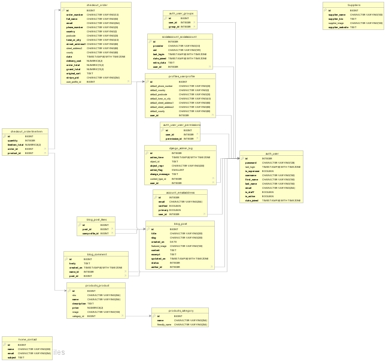
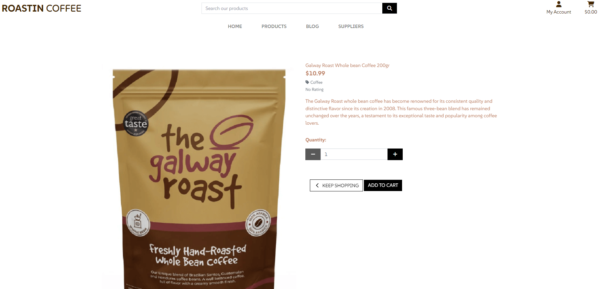

# Roastin Coffee

Roastin Coffee is currently a fictional coffee website. It is for people interested in coffee and coffee accessories. The purpose of the website is to provide people with the chance to purchase different types of coffee and coffee equipment such as coffee brewers and french presses. A live version can be found here [Roastin Coffee](https://roastin-coffee-847d35823b48.herokuapp.com/)

## E-Commerce Business Model

Roastin Coffee is a Business to Customer B2C type application. The site will sell directly to consumers in small quantities.

## Marketing Strategies.

The concept for Roastin Coffee is a small, local business offering various local produced coffee, therefore the budget for marketing is small.
However, for this type of business where word of mouth is of paramount importance, the obvious choice for marketing is through social media. This will allow the business to be promoted on local community groups with paid options allowing targeted promotion to particular groups of people. A facebook page was created and images of this you will see below. The creation of other social media pages such as Twitter, Instagram and LinkedIn could also be considered.

To keep registered users up to date with changes to the business and new promotions, a regular newsletter would be sent out via email. This would also provide a platform for sponsor information to be distributed to registered users. Signup for the newsletter works through a mailchimp form in the footer of the page.

### Facebook page

## Planning

### Wireframes

Below is a set of wireframes designs to brainstorm ideas of what the website would look like

### User Stories

As part of the Agile process I created user stories to aid with planning for the project. Although these were added to the project board in the final stages of the project, they were brainstormed before and during the project completion.

### As a User

* I can view what products are availble to purchase.
* I can add choosen products to a shopping cart.
* I can view and update my shopping cart.
* I can make purchases securely.
* I can register to the site.
* I can view and update my profile.
* I can view my order history.
* I can view blog posts.
* I can like/unlike blog posts.
* I can comment and delete my own comments on blog posts.
* I can view the supplliers and their websites.
* I can contact the owner via a contact form in case I have a payment issue, account issue or other general queries.

### Admin

As well as having the same abilities as users, admins also have the additional User Stories.

### As an Admin

* I can create blog posts.
* I can update/delete blog posts.
* I can add new products.
* I can update/delete existing products.
* I can delete user blog comments if inappropriate.
* I can add, edit and delete suppliers info.

### Discarded User Stories

These user/admin user stories unfortunately were dropped due to time constraints.

* As a user I can check a map for cafes nearby.
* As a user I can categorise products by prices and category.
* As a user I can use social platforms to register to the site.

## Database Models

There are several database Models created for the site and the different apps within it.

### Blog Model

#### Post
    title = models.CharField(max_length=200, unique=True)
    slug = models.SlugField(max_length=200, unique=True)
    author = models.ForeignKey(User, on_delete=models.CASCADE,
                               related_name="blog_posts")
    created_on = models.DateField(auto_now_add=True)
    featured_image = models.ImageField(null=True, blank=True)
    content = models.TextField()
    excerpt = models.TextField(blank=True)
    updated_on = models.DateTimeField(auto_now=True)
    status = models.IntegerField(choices=STATUS, default=0)
    likes = models.ManyToManyField(UserProfile, related_name="post_likes",
                                   blank=True)

#### Comment
    post = models.ForeignKey(Post, on_delete=models.CASCADE,
                             related_name="comments")
    name = models.ForeignKey(User, on_delete=models.CASCADE,
                             related_name="user_comments")
    body = models.TextField()
    created_on = models.DateTimeField(auto_now_add=True)

### Checkout Model

#### Order
    order_number = models.CharField(max_length=32, null=False, editable=False)
    user_profile = models.ForeignKey(UserProfile, on_delete=models.SET_NULL,
                                     null=True, blank=True, related_name='orders')
    full_name = models.CharField(max_length=50, null=False, blank=False)
    email = models.EmailField(max_length=254, null=False, blank=False)
    phone_number = models.CharField(max_length=20, null=False, blank=False)
    country = CountryField(blank_label='Country *', null=False, blank=False)
    postcode = models.CharField(max_length=20, null=True, blank=True)
    town_or_city = models.CharField(max_length=40, null=False, blank=False)
    street_address1 = models.CharField(max_length=80, null=False, blank=False)
    street_address2 = models.CharField(max_length=80, null=True, blank=True)
    county = models.CharField(max_length=80, null=True, blank=True)
    date = models.DateTimeField(auto_now_add=True)
    delivery_cost = models.DecimalField(max_digits=6, decimal_places=2, null=False, default=0)
    order_total = models.DecimalField(max_digits=10, decimal_places=2, null=False, default=0)
    grand_total = models.DecimalField(max_digits=10, decimal_places=2, null=False, default=0)
    original_cart = models.TextField(null=False, blank=False, default='')
    stripe_pid = models.CharField(max_length=254, null=False, blank=False, default='')

#### OrderLineItem
    order = models.ForeignKey(Order, null=False, blank=False, on_delete=models.CASCADE, related_name='lineitems')
    product = models.ForeignKey(Product, null=False, blank=False, on_delete=models.CASCADE)
    quantity = models.IntegerField(null=False, blank=False, default=0)
    lineitem_total = models.DecimalField(max_digits=6, decimal_places=2, null=False, blank=False, editable=False)     

### Products

#### Product
    category = models.ForeignKey('Category', null=True, blank=True, on_delete=models.SET_NULL)
    sku = models.CharField(max_length=254, null=True, blank=True)
    name = models.CharField(max_length=254)
    description = models.TextField()
    price = models.DecimalField(max_digits=6, decimal_places=2)
    image = models.ImageField(null=True, blank=True)

### Profile Model

#### UserProfile
   
    user = models.OneToOneField(User, on_delete=models.CASCADE)
    default_phone_number = models.CharField(max_length=20, null=True, blank=True)
    default_street_address1 = models.CharField(max_length=80, null=True, blank=True)
    default_street_address2 = models.CharField(max_length=80, null=True, blank=True)
    default_town_or_city = models.CharField(max_length=40, null=True, blank=True)
    default_county = models.CharField(max_length=80, null=True, blank=True)
    default_postcode = models.CharField(max_length=20, null=True, blank=True)
    default_country = CountryField(blank_label='Country', null=True, blank=True)

### Suppliers Model

#### Suppliers
    supplier_name = models.CharField(max_length=100, null=False, blank=False)
    supplier_bio = models.TextField(null=False)
    supplier_image = models.ImageField(null=True, blank=True)
    supplier_website = models.TextField(null=False)

### Contact Model

#### Contact Models
    name = models.CharField(max_length=100, null=False, blank=False)
    email = models.EmailField(null=True, blank=True)
    phone_number = models.CharField(max_length=80, null=True, blank=True)
    query = models.CharField(
        max_length=40, choices=CONTACT_CHOICE, default="GENERAL QUERY"
    )
    comments = models.CharField(max_length=2000, null=False, blank=False)

### Database relationships
A relation database image was created using Db visulaizer    

## Website Design

The sites design takes a lot of styling from the Code Institute Boutique Ado follow along lessons. I used the lessons as a base for the website and then added my own styles and models to make the project more of my own work. 

### Main page, header and footer

The header includes the Roastin Coffee name, search bar, nav bar, login button from my account and a cart for how much the items accumulate to in the current cart.
A contact form link was also added under on the My Account link.
The main screen shows an image of a cup of coffee and beans and adds a nice background so it can give users a good idea of what the websites main business is.
The footer includes contact details, a contact link so users can reach out to the owner, a link to view the business facebook page and a newsletter subscription link so users can subscribe a newsletter.

### Products

The products page shows all the products available to be purchased by the user. When a product is clicked the product description is displayed so the user has a better detail fo what type of product they are purchasing. From here the user can choose how many products they wish to purchase.

### Blog

Users can see blog posts which have been added.

### Suppliers

Users can view where the owner supplies their coffee from, some info about these suppliers and a link which brings the user to the suppliers website.

### Sign up 

Users can sign up using the by clicking on my account and then clicking on register.

### Sign in

Users can sign in by clicking on my account and then login.

### Sign Out

Users can sign out using the logout button from the my account logo.

### Success message

A message will appear once the user has signed out to show they have signed out successfully.

### Contact Form

A contact form is available under the My Account link where users can contact the owner for any issues or general enquires they may have 

## Future Features

Some features I would like to implement in future releases are as follows.
- Add a map so users can search locations of cafes in their area.
- Add a rating system so users can rate the coffee and products.
- Add a more fixed search engine to search coffee from prices and category.
- Add a forgotten password option on sign in if users have forgotten username or password which can be rest.

## Testing 

## User story testing
#### About The website
*As a User I want to understand what the website is about.*
- On the home page there is information that shows the user the purpose of the webbsite.

#### Sign up
*As a User I can Sign upto an account so that I can add purchase products.*
- On the home page there is a My Account button.  If a User clicks on this button, they will be see an option to register so they can sign up. Once they sign 
  up they will be able to purchase products.

#### Sign in/Logout
*As a user I can login and logout so I can so nobody else can view or use my profile.*
- When a User is not logged in, the My Account/Login button is visible in the top right of the website. When the user clicks on the login button, they are redirected to the sign in  
  page where 
  they need to enter their user name and password. In the top right corner of the website the user will see the option to logout from the account.
- After clicking on Logout button, the user automatically redirected to the home page.

#### Product List
*As a user I can see the product list with an image attached of that product.*
- When a user clicks on the Products button they can see the list of products available.

#### Product Details
*As a user I want to click on a product and see the type of product, product details and cost of the product*
- When a user clicks on a product it shows the type of product, the description and price.

#### Product Search
*As a user I want to be able to search a product by the product name*
- On the footer page there is a search box. If a users enters a product name a matching list should appear.

#### Adding a Product  
*As a owner I want to be able to add a products*
- Once a admin is logged in they can add products to the website.

#### Edit a Product
*As a owner I want to be able to edit a product which I created in case I need to edit the information*
- Once logged in a admin er can search products they created by searching their name. 
- When they click on a product their should be an option to edit the product.
- Only a admin can edit the products.

#### Deleting a Product
*As a admin I want to be able to delete a product which I created in case I want it removed from the list*
- Once logged in a user can search products they created by searching their name. 
- When they click on a product their should be an option to delete the product.
- Only the user who created the product can delete the product.

#### View Blog

*As a user I want to be able to view blog entries*
- Users should be able to view blog entries.

#### View Suppliers

*As a user I want to be able to view suppliers*
- Users should be able to view the coffee suppliers.
- When clicking on the View link users should be redirected to the suppliers website.

#### View and Edit items to cart
*As a user I want to be able to add items to a shopping cart*
- Users should be able to add items to shopping cart.
- Users should be able to view what is currently in the shopping cart.
- Users should be able to edit items in the shopping cart.

#### Save Profile Info

*As a user I want to be able to save profile info so the website remembers me when I login again*
- Users should be able to save their info so to not have to enter their info everytime they checkout with their cart.

#### Contact the owner

*As a user I want to be able to contact the user via a contact form in case I have issues with an order, account details or general queries*
- Users should be able to contact the owner for issues with orders, accounts or general queries.

## Manual Testing
| Feature               | Test Performed                                                     | Result  |
|-----------------------|--------------------------------------------------------------------|---------|
| Register button | Clicking on the button redirects to the sign up form                     | Pass   |
| Login button | Clicking on the button redirect to the Sign in form                          | Pass    |
| Logout button | When logged in the app, the link in the top right corner changes to Logout  | Pass    |
| Add Product | Once logged in as admin, clicking on products and then on the create button allows user to add a new product          | Pass    |
| Fill all fields when creating product | All mandatory fields must be filled when creating product or product will not be created         | Pass    |
| Edit product | Clicking on the product the user created opens details which can be edited | Pass    |
| Delete product  | Clicking on the product the user created opens details wherea button to delete products is present | Pass    |
| Search product | Entering a product name or matching descriptions, a matching list should appear  | Pass    |
| Header title  | Make sure that the correct title displayed when open either the Add or Edit form  | Pass    |
| Responsiveness | The website layout changes depending on the viewed devices         | Pass      |
| Social icon | When clicking on a social icon in the footer it opens the correct web address in the new tab       | Pass      |
| Home button | When clicking on the home button the user is directed to the home page | Pass |
| Products button | When clicking on the products button the user is brought to the products page | Pass |
| Blog button | When clicking on the blog button the user is brought to the blog page | Pass |
| Suppliers button | When clicking on the suppliers button the user is brought to the suppliers page | Pass |
| My account button | When clicking on the My Account button the user has the option to register or login | Pass |
| My profile button | When logged in, when the user clicks the my profile button they are redirected to their profile | Pass |
| Shopping Cart button | When the shopping cart icon is clicked on the user is redriected to the cart page to show what they have currently in their shopping cart | Pass |
| Add items to cart | Users are able to add item to their cart and a message appears to show what and how man items have been added | Pass |
| Edit items in cart | Users are able to edit items in their cart and a message appears to show the updated cart items | Pass |
| Remove items to cart | Users are able to add remove items from their cart and a message appears to show what and how man items have been removed | Pass |
| Keep shopping button | When in the cart page when the keep shopping button is clicked the user is redirected to products page | Pass |
| Checkout button | When in secure checkout button is clicked on the cart page the user is redirected to the checkout page | Pass |
| Add items to cart | Users are able to add item to their cart and a message appears to show what and how man items have been added | Pass |
| Free Delivery | When a user spends over $50 the delivery will be free | Pass |
| Adjust cart | When the user clicks on adjust cart button from the checkout page they will be redirected to the shopping cart | Pass |
| Complete order | When all manadatory items are filled out in the form and complete order button is clicked a thank you message with order info will appear | Pass |
| Save information button | When the button Save this information to my profile is ticked the entered information will be saved for the future purchaes | Pass |
| Mandatory form details | All mandatory form details must be filled out or the user cannnot complete their order and a message will appear to tell the user this | Pass |
| Incorrect card details | If incorrect card details are entered a message sayign you car number is invalid| Pass |
| Check out more deals button | From the checkout success page when the check out more deals button is clicked it redirects the user to the products page | Pass |

## Validation testing

### Code Validation

#### HTML Validation

There are no HTML errors, only some warnings in relation to script tag not required as you can see with the below attached screenshots of different pages which were run through the HTML W3C Markup Validation Service.

##### Home page

##### Products page

##### Blog page

##### Suppliers page

##### Profile page

##### Contact Us page

##### Cart page

##### Checkout page

#### CSS Validation

The CSS passed through the W3C Validator with no errors as seen in the image below.

#### PEP Validation

The code institure PEP validator was used to validate a number of python files from the project to make sure the python files are correctly 
indented as could be. There are few very minimal errors where the character lenght was logner by 1. As these are very minimal, these files were left as is 
so the functionalty of the scripts could run without issue. These files were webhook handler and webhooks.
Below is an screenshot of the files passed through the PEP validator

## Deployment

#### Heroku

- The requirements.txt file in the IDE must be updated to package all dependencies. To do this:

- Enter the following into the terminal: 'pip3 freeze > requirements.txt'
- Commit the changes and push to GitHub
- Sign in to heroku

- On the heroku dashboard click the create new app button

- Name the app something unique and choose what region you are in then click create app

- Go to the settings tab and the config vars section. Click reveal config vars

- Add the cloudinary_url, databse_url and secret_key plus their values in the fields

- In the field for VALUE copy and paste the entire contents of your creds.json file from your project. Then click add

- Scroll down to the Buildpacks section and click add buildpack

- Click Python then save changes

- Make sure that Python appears above Nodejs in the buildpack section. If it does not you can click and drag them to change the order

- Go to the deploy section by clicking deploy from the nav bar at the top of the page

- On the deployment method section select GitHub and click connect to GitHub

- Enter the repository name as it is in GitHub and click search

- Click the connect button next to the repository to link it to heroku

- To deploy, scroll down and click the deploy branch button

- Heroku will notify you that the app was successfully deployed with a button to view the app

### Technologies and sites used
- Django - Free and open-source, Python-based web framework that follows the model–template–views (MTV) architectural pattern.
- Python - General-purpose programming language. 
- Bootstrap - Free front-end framework for faster and easier web development.
- HTML - The standard markup language for Web pages.
- CSS -  style sheet language used for describing the presentation of a document written in a markup language such as HTML.
- JavaScript - lightweight interpreted  programming language with first-class functions.
- Github - platform and cloud-based service for software development and version control using Git.
- Gitpod - cloud development environment to efficiently and securely develop software. 
- Heroku - platform as a service (PaaS) that enables developers to build, run, and operate applications entirely in the cloud.
- Stripe - payment system used for test payments for checkout.
- Mailchimp - used for newsletter subsciption service.
- Balsamiq - used to create wireframes
- Lucidchart - used to create wireframes

### Bugs and Issues

After resubmitting my final project I was able to correct a few bugs including the checkout of items which previously gave a 500 server error.
I was also able to correct the toast message X closing button which previously did not work but is now functional.
The one issue I would like to correct and work furthe on in the future is the HTML validation. Even though the website appears fully functional 
I would like to validate the HTML with more time so code is easier to read.

## Credits

- Code Institute's "Boutique Ado" walk through provided fundamentals of creating a project with Django.

- Daisy Mcgirr who helped me with my project setup and ideas for a project and throughout.

- StackOverflow and Slack communinity for tips on how to write some of code for my project.
